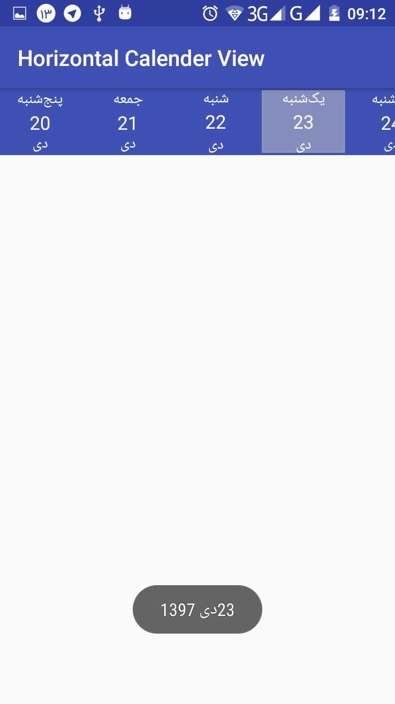

``` 
دریافت پروژه های اندروید  ۰۹۱۶۲۲۹۸۲۴۴

useAndroidX=true

```


# Persian Horizontal Calendar  Android
Persian Horizontal Calender View is a library for android.

## Demo 





<!--

 -->


### Gradle

Add following Block in root in `build.gradle(Module:app)`

``` 
allprojects {
    repositories {
        maven { url 'https://jitpack.io' }
    }
}
```

Add following line in the dependencies block in `build.gradle(Module:app)`

``` 
implementation 'com.github.mybringback22:HorizontalCalendarView-Android-:0.1.0'
```

## Using Horizontal Calendar View
### XML 

Add the followling code to your XML file

```xml

   
   
       <ir.hamed.PersianHorizontalCalendarView.PersianCalendarView
           android:id="@+id/hcv"
           android:layout_width="match_parent"
           android:layout_height="wrap_content"
           app:pcv_background="@color/colorPrimary"
           app:pcv_background_select="@drawable/background_selected_day"
           app:pcv_date_color="@color/white"
           app:pcv_day_color="@color/white"
           app:pcv_month_color="@color/white">
   
       </ir.hamed.PersianHorizontalCalendarView.PersianCalendarView>
   


```

```kotlin
import androidx.appcompat.app.AppCompatActivity
import android.os.Bundle
import android.widget.Toast
import ir.hamed.PersianHorizontalCalendarView.DayDateMonthYearModel
import ir.hamed.PersianHorizontalCalendarView.HorizontalCalendarListener
import ir.hamed.PersianHorizontalCalendarView.PersianCalendarView

class MainActivity : AppCompatActivity(), HorizontalCalendarListener {


    override fun onCreate(savedInstanceState: Bundle?) {
        super.onCreate(savedInstanceState)
        setContentView(R.layout.activity_main)
        val hcv = findViewById<PersianCalendarView>(R.id.hcv)
        hcv.setCallBack(this@MainActivity)
    }

    override fun updateMonthOnScroll(selectedDate: DayDateMonthYearModel?) {
        Toast.makeText(this@MainActivity, selectedDate?.date + "" + selectedDate?.month + " " + selectedDate?.year, Toast.LENGTH_LONG).show()
    }

    override fun newDateSelected(selectedDate: DayDateMonthYearModel?) {
        Toast.makeText(this@MainActivity, selectedDate?.date + "" + selectedDate?.month + " " + selectedDate?.year, Toast.LENGTH_LONG).show()
    }

}


```


